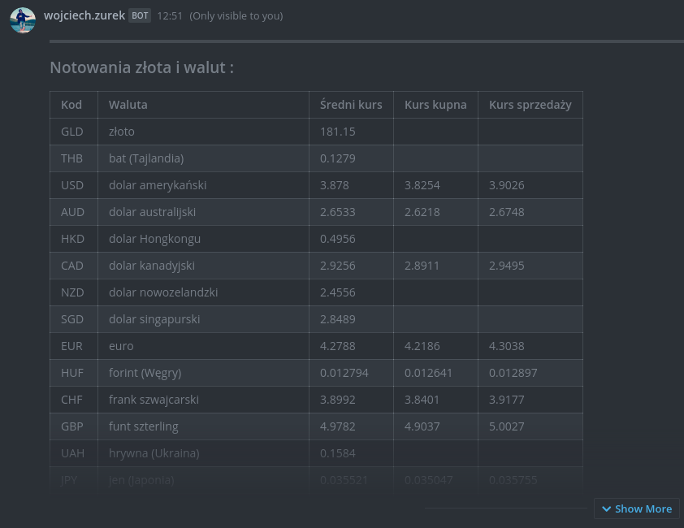

# mattermost-nbp
Mattermost slash command application. 
This app shows current exchange rates for currencies and gold from National Bank of Poland (NBP).



More info:
- https://mattermost.com/
- https://developers.mattermost.com/integrate/slash-commands/
- http://api.nbp.pl/

## Supported languages:

- polish

## Supported Mattermost response type:
- ephemeral
- in_channel

## Endpoints

Server: [http://localhost:8080](http://localhost:8080)

```
    GET /api/nbp
```

## Download

```bash
    git clone git@github.com:wojciech-zurek/mattermost-nbp.git
```

## Run with gradle

```bash
    cd mattermost-nbp/
    ./gradlew bootRun
```

## Run as jar file

```bash
    cd mattermost-nbp/
    ./gradlew bootJar
    java -jar build/libs/mattermost-nbp-0.0.1-SNAPSHOT.jar
```

## Build Docker image

```bash
    cd mattermost-nbp/
    ./build.sh
```

## Run Docker image

```bash
    docker run -p 8080:8080 eu.wojciechzurek/mattermost-nbp:latest
```